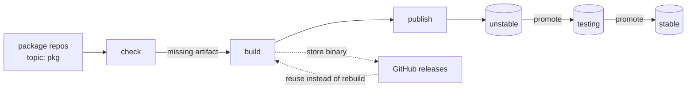

# manjaro-contrib packages

A signed pacman repository for Manjaro, built centrally from package
repositories across the `manjaro-contrib` organization.

Package repos hold nothing but a `PKGBUILD` and carry the topic
`pkg`. This repository does the rest: it discovers them,
builds what is missing, signs it, publishes it to R2, and tracks what is
waiting to move between branches. No workflow files live in the package
repos themselves.

Served from <https://packages.manjaro.download>.

## Using the repository

Import and locally sign the repository key. It is not published to a
keyserver, so fetch it from this repository:

```sh
curl -O https://raw.githubusercontent.com/manjaro-contrib/packages/main/gpg-public-key.asc
sudo pacman-key --add gpg-public-key.asc
sudo pacman-key --lsign-key E8AAE31963A022B8480CC007A13A52A61B5D8836
```

Until the key is trusted, `pacman -Sy` fails with `invalid or corrupted
database (PGP signature)`. That is the signature check working, not a
broken mirror.

Then add the repository to `/etc/pacman.conf`, above `[core]`:

```ini
[manjaro-contrib]
SigLevel = Required DatabaseRequired
Server = https://packages.manjaro.download/unstable/$arch
```

Swap `unstable` for `testing` or `stable` to follow a slower branch.
`SigLevel = Required DatabaseRequired` verifies both the packages and the
database index — without `DatabaseRequired` a signed package set can still
be rolled back or have entries removed. Both are signed, so require both.

Finally:

```sh
sudo pacman -Sy
```

## Branches

Packages are built once into `unstable` and then promoted as binaries; they
are never rebuilt for a branch. Promotion is strictly one-directional:

```
unstable -> testing -> stable
```

## How it works



State lives in the bucket, not in a database. A package needs building when
its `PKGBUILD` version has no matching artifact under the branch prefix, so
the check is a stateless comparison that survives a lost run or a manual
upload.

## Workflows

| Workflow | Trigger | Does |
| --- | --- | --- |
| `build-publish` | cron, dispatch, `repository_dispatch` | discovers, builds, signs, publishes to `unstable` |
| `promotion-proposal` | cron, after a branch changes | opens a PR moving a branch manifest up to its source |
| `apply-manifest` | merge of `branches/*.yml` | reconciles the branch on R2 to its manifest |
| `repo-remove` | manual | deletes a package from branches and the database |
| `update-upstreams` | cron | opens PRs when a tracked AUR package changes |
| `promotion-backlog` | cron, after the above | keeps one issue per branch listing what is pending |
| `sync-codeowners` | on `packages.yml`, cron | writes CODEOWNERS into each package repo from `maintainers` |
| `sync-package-list` | cron | opens a PR adding repos that carry the topic but are missing from `packages.yml` |
| `sync-edition-topics` | cron | tags each repo `edition-<name>` for every edition whose settings package depends on it |

Every workflow that writes the database shares the `repo-publish`
concurrency group, so publishes, promotions and removals queue rather than
clobber each other.

### Promoting

Promotion is declarative. `branches/testing.yml` and `branches/stable.yml`
name the exact version each branch carries, and merging a change to one is
what promotes: `promotion-proposal` opens a pull request moving a branch up
to its source, and `apply-manifest` reconciles the bucket on merge.

Reviewing the diff is the approval step, so what shipped and who approved
it is in git history. Editing a manifest by hand works the same way -
pinning an older version rolls back, deleting an entry withdraws a package.

### Adding a package

Create a repository containing a `PKGBUILD`, add the topic
`pkg`, and it is picked up on the next run. Edition membership is derived,
not declared: a package carries `edition-sway` because
`manjaro-sway-settings` depends on it, directly or transitively. To track an AUR
Add it to [`packages.yml`](packages.yml), which inventories every package
this repository builds. Give it an `upstream` to have update PRs opened
automatically when that source moves; omit it for packages maintained
here. `maintainers` is also the source for each package repo's
CODEOWNERS, so listing someone there makes them a reviewer on every pull
request in that repository.

## Repository layout

```
scripts/          the engine; each script is runnable on its own
branches/         the package set each branch carries, applied on merge
worker/           cloudflare worker serving the bucket with directory listings
packages.yml      every package built here, and what it tracks
gpg-public-key.asc  the repository signing key
```

Objects are laid out as `<branch>/<arch>/`, alongside BoxIt-style `state`
files at the root and per branch, mirroring what Manjaro's own mirrors
serve so mirror tooling can poll a hash instead of walking the tree.

## Operating

Configuration lives in GitHub. Variables: `REPO_URL`, `GPG_KEYID`.
Secrets: `R2_ENDPOINT`, `R2_ACCESS_KEY_ID`, `R2_SECRET_ACCESS_KEY`,
`R2_BUCKET`, `GPG_SECRET_BASE64`, `DISPATCH_TOKEN`.

`DISPATCH_TOKEN` is a fine-grained token over the organization needing
Contents read/write, Pull requests read/write, and Issues read/write.

The scripts run locally against the same environment variables, which is
the fastest way to check a change before pushing it:

```sh
set -a && . ./.env && set +a
GITHUB_TOKEN="$DISPATCH_TOKEN" python3 scripts/check_updates.py \
  --org manjaro-contrib --repo-url "$REPO_URL"
```

The signing key is passphrase-less so unattended builds can use it. Anyone
with access to the repository secrets can therefore sign packages; treat
`GPG_SECRET_BASE64` as production credentials and keep the revocation
certificate somewhere durable.
