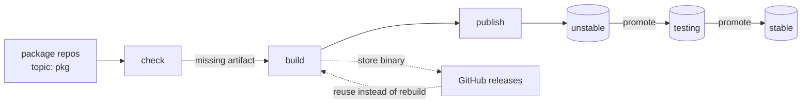

# manjaro-contrib packages

A signed pacman repository for Manjaro, built centrally from package
repositories across the `manjaro-contrib` organization.

Package repos hold nothing but a `PKGBUILD` and carry the topic
`pkg`. This repository does the rest: it discovers them,
builds what is missing, signs it, publishes it to R2, and tracks what is
waiting to move between branches. No workflow files live in the package
repos themselves.

Served from <https://packages.manjaro.download>.

## Using the repository

Import and locally sign the repository key:

```sh
sudo pacman-key --keyserver keyserver.ubuntu.com --recv-keys A13A52A61B5D8836
sudo pacman-key --lsign-key A13A52A61B5D8836
```

`keys.openpgp.org` serves the key without its identity, since that server
verifies an address before publishing one; use a keyserver that carries the
full key, or take it from [`gpg-public-key.asc`](gpg-public-key.asc) here.

The key is also certified by Jonas Strassel's key
(`A44C644D792767CED7941AFEABB2075D5F310CF8`, in `manjaro-trusted`), which
vouches for it belonging to this project. Pacman does not follow that
chain, though: it requires the local signature above regardless.

Until the key is locally signed, `pacman -Sy` fails with `signature from
"manjaro-contrib build server" is unknown trust`. That is the signature
check working, not a broken mirror.

Then add the repository to `/etc/pacman.conf`, above `[core]`:

```ini
[manjaro-contrib]
SigLevel = Required DatabaseRequired
Server = https://packages.manjaro.download/unstable/$arch
```

Swap `unstable` for `testing` or `stable` to follow a slower branch.
`SigLevel = Required DatabaseRequired` verifies both the packages and the
database index — without `DatabaseRequired` a signed package set can still
be rolled back or have entries removed. Both are signed, so require both.

Finally:

```sh
sudo pacman -Sy
```

## Branches

Packages are built once into `unstable` and then promoted as binaries; they
are never rebuilt for a branch. Promotion is strictly one-directional:

```
unstable -> testing -> stable
```

## How it works



State lives in the bucket, not in a database. A package needs building when
its `PKGBUILD` version has no matching artifact under the branch prefix, so
the check is a stateless comparison that survives a lost run or a manual
upload.

## Workflows

| Workflow | Trigger | Does |
| --- | --- | --- |
| `build-publish` | cron, dispatch, `repository_dispatch` | discovers, builds, signs, publishes to `unstable` |
| `promotion-proposal` | cron, after a branch changes | opens a PR moving a branch manifest up to its source |
| `apply-manifest` | merge of `branches/*.yml` | reconciles the branch on R2 to its manifest |
| `repo-remove` | manual | pulls a broken package immediately, without waiting for a config change |
| `sync-unstable` | on `packages.yml` | withdraws packages from `unstable` once they are unlisted |
| `update-upstreams` | cron | opens PRs when a tracked AUR package changes |
| `sync-codeowners` | on `packages.yml`, cron | writes CODEOWNERS into each package repo from `maintainers` |
| `sync-package-list` | cron | opens a PR adding repos that carry the topic but are missing from `packages.yml` |
| `check-upstream-dupes` | weekly, on `packages.yml` | keeps an issue listing packages Arch now ships |
| `check-repo` | daily, after each publish | verifies a published branch actually resolves |
| `report-failures` | hourly | keeps an issue listing workflows whose latest run failed |
| `rebuild-db` | manual | regenerates a branch's databases from the packages on R2 |
| `sync-edition-topics` | cron | tags each repo `edition-<name>` for every edition whose settings package depends on it |
| `build-images` | on `images/`, weekly | publishes the prebuilt toolchain images the other jobs run in |

Every workflow that writes the database shares the `repo-publish`
concurrency group, so publishes, promotions and removals queue rather than
clobber each other.

### Promoting

Promotion is declarative. `branches/testing.yml` and `branches/stable.yml`
name the exact version each branch carries, and merging a change to one is
what promotes: `promotion-proposal` opens a pull request moving a branch up
to its source, and `apply-manifest` reconciles the bucket on merge.

Reviewing the diff is the approval step, so what shipped and who approved
it is in git history. Editing a manifest by hand works the same way -
pinning an older version rolls back, deleting an entry withdraws a package.

`unstable` has no manifest, because it is built into rather than promoted
into. [`packages.yml`](packages.yml) plays that role instead: it already
authorises builds, and `sync-unstable` makes it authoritative for what
stays published, so unlisting a package withdraws it there too. Every
branch is therefore declarative, and `repo-remove` is left for what it is
actually good for - pulling a broken package immediately, without waiting
for a config change to merge.

### Adding a package

Create a repository containing a `PKGBUILD` and add the topic `pkg`. The
topic makes it discoverable, but a package is built only once it is also
listed in [`packages.yml`](packages.yml) - `sync-package-list` opens that
pull request for you, and merging it is what authorises the build. To track an AUR
Add it to [`packages.yml`](packages.yml), which inventories every package
this repository builds.

An overlay only earns its keep where the distribution falls short, so
`check-upstream-dupes` compares the list against Arch's repositories
weekly. Arch is checked rather than Manjaro because a package reaching
Arch flows downstream on its own, which is the earliest point at which
ours becomes redundant.

Findings are kept in one `upstream-redundant` issue rather than failing
the run: the issue is opened when a package becomes redundant, edited as
the list changes, and closed once nothing is left. If the duplication is
deliberate, say why with an `override` key and the check lists it as
intentional instead. Give it an `upstream` to have update PRs opened
automatically when that source moves; omit it for packages maintained
here. `maintainers` is also the source for each package repo's
CODEOWNERS, so listing someone there makes them a reviewer on every pull
request in that repository.

### Consistency

The state hash says a branch changed, not that it works - a partial upload
produces a new hash just as a good one does. `check-repo` verifies what a
pacman client actually depends on: every database entry names a file that
is present at the recorded size, every published package has an entry,
`.db` and `.files` agree, and packages and databases are signed. It runs
after each publish for the branch just written, and daily across all of
them, keeping findings in a `repo-inconsistent` issue.

Breakage is reported rather than left in the logs: `report-failures`
keeps a `ci-failing` issue listing every workflow whose most recent run on
`main` did not succeed. A workflow is judged by its latest run only, so a
row clears when it next passes and the issue closes when all of them do.

`rebuild-db` is the repair. Every other database write is incremental,
which is how a database comes to describe something other than the bucket;
this one lists the branch and runs `repo-add` over everything it finds, so
the packages on R2 are the authority. It defaults to a dry run, holds the
same `repo-publish` lock as publishing, and re-runs `check-repo` after
writing - a rebuild that left the branch inconsistent would be worse than
the drift it repaired.

## Repository layout

```
scripts/          the engine; each script is runnable on its own
images/           the container images the workflows run in
branches/         the package set each branch carries, applied on merge
worker/           cloudflare worker serving the bucket with directory listings
packages.yml      every package built here, and what it tracks
gpg-public-key.asc  the repository signing key
```

Objects are laid out as `<branch>/<arch>/`, alongside BoxIt-style `state`
files at the root and per branch, mirroring what Manjaro's own mirrors
serve so mirror tooling can poll a hash instead of walking the tree.

## Operating

Configuration lives in GitHub. Variables: `REPO_URL`, `GPG_KEYID`,
`APP_ID`. Secrets: `R2_ENDPOINT`, `R2_ACCESS_KEY_ID`,
`R2_SECRET_ACCESS_KEY`, `R2_BUCKET`, `GPG_SECRET_BASE64`,
`APP_PRIVATE_KEY`.

The workflows authenticate as a GitHub App installed on the organization,
minting a short-lived token per run. Commits an App makes through the API
are signed by GitHub, so `required_signatures` can be enforced without any
signing key in CI, and the App's permissions cover every repository in the
organization without a long-lived personal token.

The scripts run locally against the same environment variables, which is
the fastest way to check a change before pushing it:

```sh
set -a && . ./.env && set +a
GITHUB_TOKEN="$DISPATCH_TOKEN" python3 scripts/check_updates.py \
  --org manjaro-contrib --repo-url "$REPO_URL"
```

The signing key is passphrase-less so unattended builds can use it. Anyone
with access to the repository secrets can therefore sign packages; treat
`GPG_SECRET_BASE64` as production credentials and keep the revocation
certificate somewhere durable.

It signs nothing but this repository, so a compromise here is contained
and the key can be revoked without affecting anything else. The
certification on it only attests to who it belongs to; renewing or
replacing that does not require re-signing packages.
